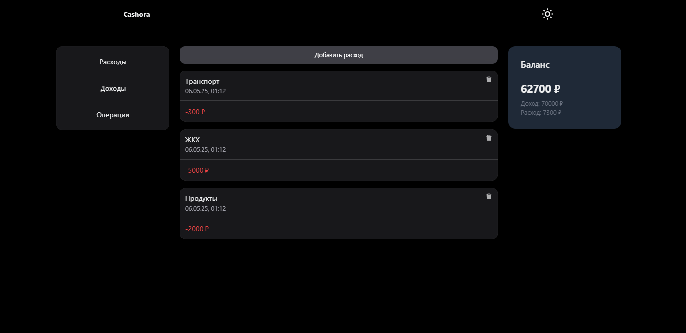
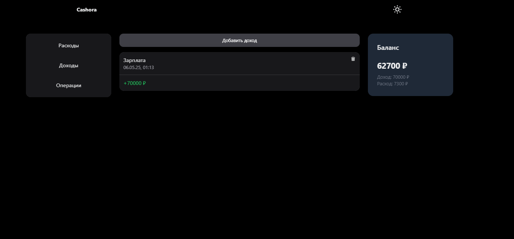
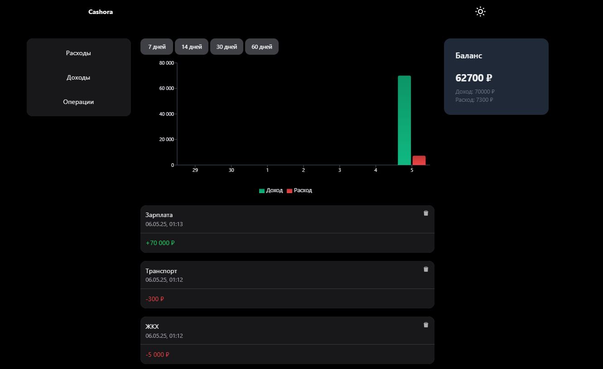

# 💰 Cashora — персональный финансовый трекер

**Cashora** — это современное веб-приложение для учёта личных финансов. Оно помогает отслеживать доходы и расходы, анализировать финансовые привычки и принимать обоснованные решения.

---

## 🚀 Ключевые возможности

### 📊 Учёт финансов
- Добавление доходов и расходов по категориям
- Описание каждой транзакции
- История всех операций
- Удаление некорректных данных

### 📈 Аналитика
- Графики за 7, 14, 30 или 60 дней
- Отдельный учёт доходов и расходов
- Автоматический расчёт баланса
- Отображение общего дохода и расхода

### 🎨 Интерфейс
- Адаптивный дизайн (мобильные и десктопные устройства)
- Светлая и тёмная темы
- Современный UI с использованием компонентов HeroUI
- Удобная и интуитивная навигация

---

## 🛠️ Технологии

### Основной стек
- **React 18** — UI-библиотека
- **TypeScript** — статическая типизация
- **Tailwind CSS** — утилитарный CSS
- **HeroUI** — готовые компоненты интерфейса
- **Recharts** — визуализация данных
- **React Router v6** — маршрутизация
- **Vite** — быстрый сборщик

### Дополнительно
- **React Icons** — набор иконок
- **Date-fns** — работа с датами

---

## Живая демо-версия

Посмотреть живую версию приложения можно [здесь](https://sanferq.github.io/cashora/).

---

## Скриншоты

### Основной интерфейс

---

src/
├── components/           
│   ├── balanced-card.tsx     # Карточка баланса
│   ├── button.tsx            # Кнопка
│   ├── container.tsx         # Обёртка контента
│   ├── header.tsx            # Шапка приложения
│   ├── modal.tsx             # Модальное окно
│   ├── nav-bar.tsx           # Панель навигации
│   └── simple.tsx            # Диаграмма
├── context/
│   └── finance-context.tsx   # Контекст для финансов
├── data/
│   └── money.ts              # Категории и типы
├── pages/
│   ├── expenses.tsx          # Страница расходов
│   ├── income.tsx            # Страница доходов
│   ├── layout.tsx            # Основной лейаут
│   └── transactions.tsx      # Все транзакции
├── utils/
│   └── date.ts               # Работа с датами
├── App.tsx                   # Главный компонент
└── main.tsx                  # Точка входа

---

## Контакты

Свяжитесь с нами:

- **GitHub**: [@sanferq](https://github.com/sanferq)
- **LinkedIn**: [Maksim Proselkin](https://www.linkedin.com/in/maksim-proselkin-769790363/)
- **Email**: [proselkinmaksim@gmail.com](mailto:proselkinmaksim@gmail.com)
